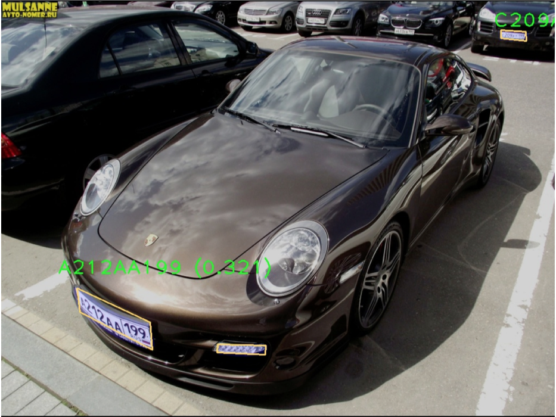
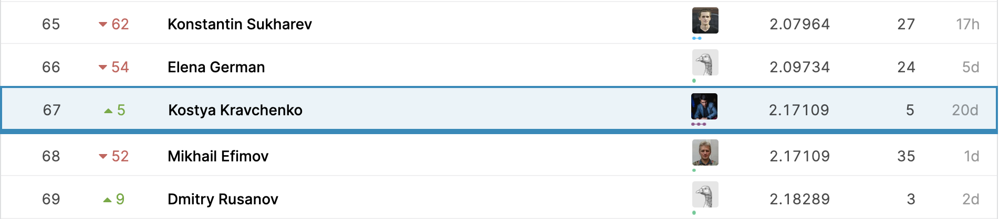

## Car plates OCR Competition Solution within MADE Computer Vision Course
### Predict car plate numbers from the pictures.
https://www.kaggle.com/c/car-plates-ocr-made

### General Approach
1. Detect the car plates
  * MASKRCNN model with ResNet50 backbone for bounding box detection and mask segmentation predictions
  * Adam Optimizer with Reduce On Plateau scheduler
2. Car plates OCR
  * Generate a bounding box for each car plate and cut to form a rectangle
  * CRNN model with ResNet18 backbone
  * AdamW optimizer with Reduce On Plateau scheduler

### Config
* TRAIN_SIZE = 0.9
* BATCH_SIZE = 4
* BATCH_SIZE_OCR = 128
* LR = 1e-3
* PATIENCE = 3
* FACTOR = 0.9
* THRESHOLD_SCORE = 0.93
* TRESHOLD_MASK = 0.05
* 1 epoch for detection and 3 epochs for OCR

### Results
72nd Public and 67th Private place at the leaderboard!

